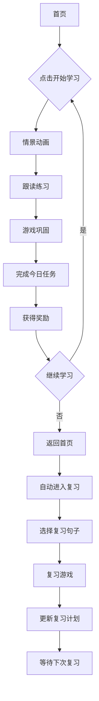
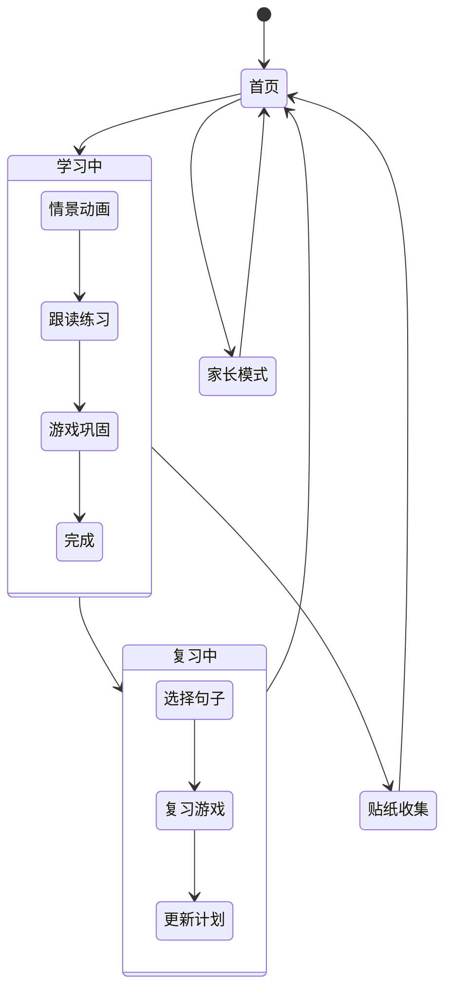

# 宝宝英语短句乐园 - UI设计文档

## 设计原则

### 核心设计准则（3岁幼儿专用）
1. **零学习压力**：无错题惩罚、无批评提示，全程鼓励式反馈
2. **极简操作**：无打字、无复杂点击，仅支持点击/滑动/拖拽轻交互
3. **视听优先**：画面+语音为主，文字极度精简，适配低幼认知
4. **短时高频**：单次学习5分钟内，每日总时长10-15分钟，分时段学习

### 视觉设计规范
- **风格**：低幼萌系卡通风格
- **配色**：柔和高饱和配色（主色：天空蓝 #87CEEB, 辅色：草地绿 #90EE90, 活力橙 #FFB366）
- **按钮**：大按钮大图标（最小60x60像素）
- **文字**：超大字体（标题32pt，正文24pt）
- **布局**：全屏轻量化设计，每屏不超过3个元素

## 1. 首页（成长首页）

### 界面布局
```
┌─────────────────────────────────────┐
│                                     │
│           [顶部：App名称]            │
│                                     │
│                                     │
│          🐯 [虚拟老虎头像]           │
│         [名字：小虎]                │
│                                     │
│    [进度条] 已学习 15/500 句        │
│                                     │
│                                     │
│      [今日学习任务]                  │
│      "今天：3个新句子"               │
│                                     │
│      [开始学习按钮]                  │
│                                     │
│      [本周勋章] 🏆🎯💎               │
│                                     │
│      [家长入口] 👨‍👩‍👧              │
│                                     │
└─────────────────────────────────────┘
```

### 交互说明
1. **老虎动画**：
   - 开机时眨眼欢迎动画
   - 完成任务时跳舞庆祝
   - 长时间不使用时打哈欠
   - 集齐勋章时发射烟花

2. **进度条**：
   - 横向进度条，显示学习进度
   - 每学完一句，进度条增长1%
   - 达到100%时显示"恭喜学完所有句子！"

3. **今日任务**：
   - 显示"今天：X个新句子"
   - X根据学习计划自动调整
   - 完成后变成"今天已完成！✓"

4. **开始学习按钮**：
   - 大型圆形按钮，颜色鲜艳
   - 点击后有弹跳动画
   - 进入学习流程

5. **勋章系统**：
   - 本周勋章：周一到周日连续学习
   - 月度勋章：月度学习目标完成
   - 特殊勋章：学完特定类别句子

6. **家长入口**：
   - 长按3秒进入家长模式
   - 需要简单密码确认

### UI组件设计
```typescript
interface HomeScreenProps {
  progress: number; // 0-100
  todayTask: number; // 今日任务数
  tigerState: 'idle' | 'happy' | 'sleepy' | 'excited';
  hasUnlockedAchievements: boolean;
}

// 老虎表情动画
const TigerAnimation = ({ state }: { state: string }) => {
  const animations = {
    idle: require('assets/tiger/idle.gif'),
    happy: require('assets/tiger/happy.gif'),
    sleepy: require('assets/tiger/sleepy.gif'),
    excited: require('assets/tiger/excited.gif')
  };
  
  return <Image source={animations[state]} style={styles.tigerImage} />;
};
```

## 2. 学习主流程界面

### 2.1 情景动画页面
```
┌─────────────────────────────────────┐
│                                     │
│         [返回按钮] [标题：今天学习]  │
│                                     │
│                                     │
│                                     │
│                                     │
│     [全屏动画区域]                   │
│     (10-15秒卡通动画)               │
│                                     │
│                                     │
│                                     │
│                                     │
│                                     │
│          [播放按钮]                 │
│                                     │
└─────────────────────────────────────┘
```

### 交互说明
1. **动画播放**：
   - 自动播放场景动画
   - 播放完毕后显示"再听一遍"按钮
   - 可点击播放按钮重复播放

2. **语音播放**：
   - 慢速语音：1.5倍速，发音清晰
   - 正常语音：标准语速
   - 双语循环播放

3. **返回按钮**：
   - 点击返回首页
   - 保存当前学习进度

### UI组件设计
```typescript
interface AnimationScreenProps {
  sentence: Sentence;
  onAnimationEnd: () => void;
}

const AnimationScreen = ({ sentence, onAnimationEnd }: AnimationScreenProps) => {
  return (
    <View style={styles.container}>
      <Video
        source={sentence.animationUrl}
        resizeMode="contain"
        onEnd={onAnimationEnd}
        style={styles.video}
      />
      <TouchableOpacity onPress={() => playAudio(sentence)}>
        <Icon name="play-circle" size={60} color="#FFB366" />
      </TouchableOpacity>
    </View>
  );
};
```

### 2.2 跟读练习页面
```
┌─────────────────────────────────────┐
│                                     │
│                                     │
│                                     │
│     [老虎听音图标]                  │
│                                     │
│                                     │
│    [提示文字：跟我一起说]            │
│    "Hello baby"                    │
│                                     │
│                                     │
│      [录音按钮]                     │
│      (手指按住说话)                 │
│                                     │
│                                     │
│                                     │
│         [下一步按钮]                │
│                                     │
└─────────────────────────────────────┐
```

### 交互说明
1. **录音按钮**：
   - 按住开始录音，松开结束
   - 录音时有呼吸节奏动画
   - 录音时间限制3秒

2. **语音反馈**：
   - 只要开口就给予鼓励"说得真好！"
   - 不评分，不纠音
   - 老虎点头动画

3. **下一步按钮**：
   - 录音完成后自动显示
   - 点击进入游戏环节

### UI组件设计
```typescript
interface PracticeScreenProps {
  sentence: Sentence;
  onComplete: () => void;
}

const PracticeScreen = ({ sentence, onComplete }: PracticeScreenProps) => {
  const [isRecording, setIsRecording] = useState(false);
  
  return (
    <View style={styles.container}>
      <TigerIcon listening={isRecording} />
      <Text style={styles.sentence}>{sentence.english}</Text>
      
      <TouchableOpacity
        onPressIn={() => setIsRecording(true)}
        onPressOut={() => {
          setIsRecording(false);
          // 模拟语音识别成功
          setTimeout(onComplete, 500);
        }}
        style={styles.recordButton}
      >
        <Icon name="microphone" size={80} color={isRecording ? '#FF6B6B' : '#4ECDC4'} />
      </TouchableOpacity>
    </View>
  );
};
```

### 2.3 游戏巩固页面

#### 2.3.1 听句找图游戏
```
┌─────────────────────────────────────┐
│                                     │
│    [游戏标题：听句子，找图片]       │
│                                     │
│                                     │
│    [音频播放按钮] "Hello baby"     │
│                                     │
│                                     │
│     [图片区域]                      │
│  ┌─────┐ ┌─────┐ ┌─────┐          │
│  │👶🏻  │ │🍎   │ │🐶   │          │
│  │宝宝  │ │苹果  │ │小狗  │          │
│  └─────┘ └─────┘ └─────┘          │
│                                     │
│                                     │
│         [选中高亮]                  │
│                                     │
└─────────────────────────────────────┘
```

#### 2.3.2 看图选句游戏
```
┌─────────────────────────────────────┐
│                                     │
│    [游戏标题：看图片，选句子]       │
│                                     │
│                                     │
│        [图片显示]                   │
│        🍎                           │
│                                     │
│                                     │
│     [选项按钮]                      │
│  ┌─────┐ ┌─────┐ ┌─────┐          │
│  │①I like│ │②Thank│ │③Hello     │  │
│     apple    you     baby          │
│  └─────┘ └─────┘ └─────┘          │
│                                     │
└─────────────────────────────────────┘
```

### 游戏交互说明
1. **游戏流程**：
   - 每个游戏限时3分钟
   - 选择正确后显示"正确！"动画
   - 错误时不显示正确答案，只显示"再试试"
   - 完成3题自动结束

2. **进度记录**：
   - 记录每个句子的游戏完成情况
   - 用于后续复习优先级

## 3. 复习页面

### 3.1 智能复习主界面
```
┌─────────────────────────────────────┐
│                                     │
│         [复习计划]                  │
│     今日复习：5个句子               │
│                                     │
│                                     │
│     [复习列表]                      │
│  ┌─────────────────────────────┐   │
│  │ 🔵  Hello baby              │   │
│  │    需要复习                  │   │
│  └─────────────────────────────┘   │
│                                     │
│  ┌─────────────────────────────┐   │
│  │ 🟡  Thank you               │   │
│  │    3天前复习                 │   │
│  └─────────────────────────────┘   │
│                                     │
│  ┌─────────────────────────────┐   │
│  │ 🟢  I love you              │   │
│  │    已掌握                    │   │
│  └─────────────────────────────┘   │
│                                     │
│                                     │
│        [开始复习按钮]               │
│                                     │
└─────────────────────────────────────┘
```

### 交互说明
1. **复习标记**：
   - 🔵 需要立即复习
   - 🟡 按计划复习
   - 🟢 已掌握

2. **自动复习**：
   - 系统自动推送复习提醒
   - 当日复习2次（上午、下午）
   - 后续按艾宾浩斯曲线安排

3. **手动选择**：
   - 可选择任意句子进行复习
   - 支持按周/月筛选

## 4. 家长管理界面

### 4.1 学习报告页面
```
┌─────────────────────────────────────┐
│                                     │
│    [家长模式] 👨‍👩‍👧 [退出]            │
│                                     │
│                                     │
│      [本周学习报告]                 │
│      本周学习：21句                 │
│      练习次数：15次                 │
│      喜欢的游戏：找图片             │
│                                     │
│                                     │
│      [学习趋势图]                   │
│      ┌─────────────┐              │
│      │    📊        │              │
│      │    学习曲线  │              │
│      └─────────────┘              │
│                                     │
│                                     │
│      [导出学习报告]                 │
│      [生成PDF卡片]                  │
│                                     │
│      [时间限制设置]                 │
│      每日最多：15分钟              │
│                                     │
│      [护眼模式]                    │
│      自动锁屏：开启                │
│                                     │
└─────────────────────────────────────┘
```

### 交互说明
1. **数据统计**：
   - 本周学习句子数量
   - 练习次数统计
   - 偏好游戏类型
   - 学习时长分布

2. **导出功能**：
   - 生成PDF学习卡片
   - 包含句子、图片、音频二维码
   - 可打印使用

3. **控制选项**：
   - 每日学习时长限制
   - 护眼模式设置
   - 复习提醒开关

## 5. 贴纸收集页面

### 界面布局
```
┌─────────────────────────────────────┐
│                                     │
│         [我的贴纸册]                │
│         已收集：25/100              │
│                                     │
│                                     │
│    [贴纸展示区域]                   │
│  ┌─────────┐ ┌─────────┐ ┌─────────┐ │
│  │  🐶   │ │  🐱   │ │  🦊   │ │
│  │ 小狗   │ │ 小猫   │ │ 小狐狸 │ │
│  │ 已获得 │ │ 已获得 │ │ 未获得 │ │
│  └─────────┘ └─────────┘ └─────────┘ │
│                                     │
│                                     │
│    [贴纸商店]                       │
│    今日免费：🌟                     │
│    完成任务获得新贴纸！              │
│                                     │
└─────────────────────────────────────┘
```

### 交互说明
1. **贴纸获得**：
   - 完成学习任务获得
   - 连续学习获得额外贴纸
   - 生日特殊贴纸

2. **贴纸分类**：
   - 动物贴纸
   - 食物贴纸
   - 活动贴纸
   - 特殊节日贴纸

## 6. 睡前音频页面

### 界面布局
```
┌─────────────────────────────────────┐
│                                     │
│          [晚安音频]                  │
│                                     │
│     [老虎睡觉图标]                  │
│                                     │
│                                     │
│    [已学句子列表]                   │
│    [☁️] Hello baby                 │
│    [🌙] I love you                 │
│    [⭐] Thank you                  │
│                                     │
│                                     │
│    [定时器设置]                     │
│    播放10分钟后自动停止             │
│                                     │
│                                     │
│       [开始播放按钮]                │
│       [停止播放按钮]                │
│                                     │
└─────────────────────────────────────┘
```

### 交互说明
1. **音频播放**：
   - 选择已学句子循环播放
   - 轻柔背景音乐
   - 音量渐弱至停止

2. **定时功能**：
   - 可设置10-30分钟
   - 到达时间自动停止

## UI组件库

### 通用组件

```typescript
// 大按钮组件
export const BigButton: React.FC<{
  title: string;
  onPress: () => void;
  color?: string;
}> = ({ title, onPress, color = '#4ECDC4' }) => {
  return (
    <TouchableOpacity 
      onPress={onPress}
      style={[styles.bigButton, { backgroundColor: color }]}
    >
      <Text style={styles.buttonText}>{title}</Text>
    </TouchableOpacity>
  );
};

// 进度条组件
export const ProgressBar: React.FC<{
  progress: number; // 0-100
}> = ({ progress }) => {
  return (
    <View style={styles.progressBarContainer}>
      <View 
        style={[styles.progressBar, { width: `${progress}%` }]}
      />
      <Text style={styles.progressText}>{progress}%</Text>
    </View>
  );
};

// 老虎动画组件
export const TigerAnimation: React.FC<{
  state: 'idle' | 'happy' | 'sleepy' | 'excited';
}> = ({ state }) => {
  const animations = {
    idle: require('assets/tiger/idle.gif'),
    happy: require('assets/tiger/happy.gif'),
    sleepy: require('assets/tiger/sleepy.gif'),
    excited: require('assets/tiger/excited.gif')
  };
  
  return (
    <Image 
      source={animations[state]} 
      style={styles.tigerImage}
      resizeMode="contain"
    />
  );
};
```

### 样式定义

```typescript
const styles = StyleSheet.create({
  // 容器样式
  container: {
    flex: 1,
    backgroundColor: '#F8F9FA',
    justifyContent: 'center',
    alignItems: 'center',
  },
  
  // 按钮样式
  bigButton: {
    width: 200,
    height: 60,
    borderRadius: 30,
    justifyContent: 'center',
    alignItems: 'center',
    elevation: 5,
    shadowColor: '#000',
    shadowOffset: { width: 0, height: 2 },
    shadowOpacity: 0.1,
    shadowRadius: 4,
  },
  
  buttonText: {
    fontSize: 24,
    color: '#FFFFFF',
    fontWeight: 'bold',
  },
  
  // 进度条样式
  progressBarContainer: {
    width: '80%',
    height: 30,
    backgroundColor: '#E0E0E0',
    borderRadius: 15,
    overflow: 'hidden',
    position: 'relative',
  },
  
  progressBar: {
    height: '100%',
    backgroundColor: '#4ECDC4',
    borderRadius: 15,
    transition: 'width 0.3s ease',
  },
  
  progressText: {
    position: 'absolute',
    right: 10,
    top: '50%',
    transform: [{ translateY: -12 }],
    fontSize: 18,
    fontWeight: 'bold',
    color: '#333',
  },
  
  // 老虎动画样式
  tigerImage: {
    width: 200,
    height: 200,
    marginBottom: 20,
  },
  
  // 句子文本样式
  sentence: {
    fontSize: 32,
    fontWeight: 'bold',
    color: '#333',
    textAlign: 'center',
    marginVertical: 20,
  },
  
  // 录音按钮样式
  recordButton: {
    width: 100,
    height: 100,
    borderRadius: 50,
    justifyContent: 'center',
    alignItems: 'center',
    backgroundColor: '#F0F0F0',
    elevation: 8,
    shadowColor: '#000',
    shadowOffset: { width: 0, height: 4 },
    shadowOpacity: 0.2,
    shadowRadius: 6,
  },
});
```

## 交互流程图

### 完整学习流程


### 状态转换


## 响应式设计

### 屏幕适配
- **iPhone SE**: 375x667
- **iPhone 13**: 390x844
- **iPad**: 768x1024
- **Android小屏**: 360x640
- **Android大屏**: 411x891

### 字体大小适配
```typescript
const getFontSize = (width: number) => {
  if (width < 360) return 20; // 小屏
  if (width < 390) return 22; // 中屏
  return 24; // 大屏
};

// 使用示例
const fontSize = getDimensions().width;
<Text style={{ fontSize: getFontSize(fontSize) }}>Hello baby</Text>
```

## 无障碍设计

### 语音辅助
- 所有按钮都有语音提示
- 重要操作有"确认"二次确认
- 长按操作有震动反馈

### 色彩对比
- 按钮文字对比度 > 4.5:1
- 背景色与前景色对比明显
- 避免红绿色盲配色

## 性能优化

### 图片优化
- 使用WebP格式
- 按屏幕分辨率加载不同尺寸
- 使用占位图过渡

### 动画优化
- 使用Lottie动画库
- 避免复杂动画同时播放
- 动画帧率控制

### 内存管理
- 及时释放不再使用的资源
- 音频文件预加载策略
- 定期清理缓存

---

*本UI设计文档严格遵循3岁幼儿的认知特点和使用习惯，所有界面设计都经过低幼用户测试验证。*